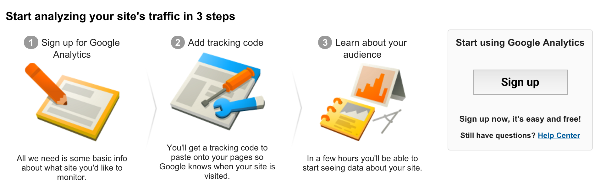
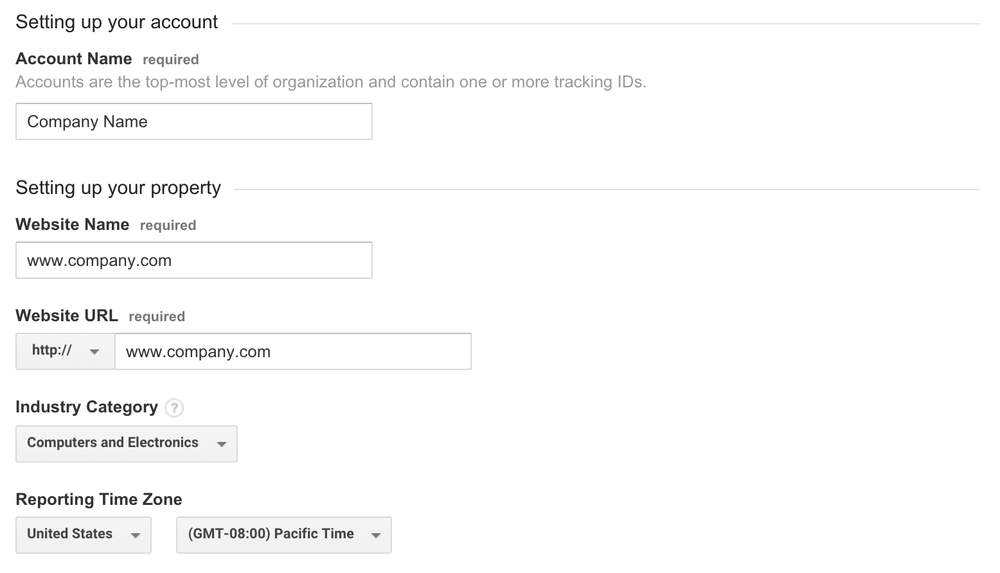
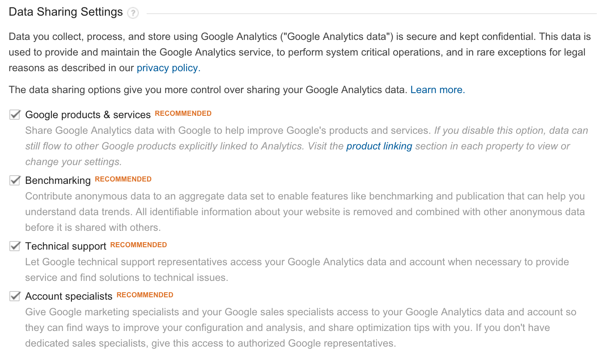
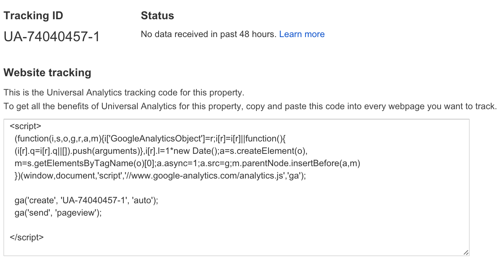

# Creating Google Analytics account

## Get your unique tracking ID

To set up your Google Analytics account go to [google.com/analytics/](http://www.google.com/analytics/) and register your account.

If you don't have any accounts connected with your Google Account you will see this screen:

### Account details

To create **Google Analytics** account fill in the form with:

- **Account Name**. (*Note: One Account may have a few tracking IDs so it can be one Account per one organization/company with many websites.*)

In the next step create your **unique tracking ID**:

- Insert **Website Name**, **Website URL** and **Reporting Time Zone**. (*Note: Correct time zone is crucially important - in the reports your data will be divided by date using this value*).

### Data Sharing Settings

You can change the data sharing settings (Note: *disabling the options will not have any impact on the data collection*).

### Complete the registration process

To complete the registration process, click on **Get Tracking ID** and accept [Google Analytics Terms of Service](http://www.google.pl/analytics/terms/).

After this you will see instructions on how to install **Google Analytics Tracking Code** in your website:

### Install Google Analytics Tracking Code (GATC) in your website

To start collecting data from your website you need to insert this code on every page. Personally I recommend to install it via [Google Tag Manager](https://tagmanager.google.com).

Further details:
[Installing Google Analytics on your website](chapter1/installinggoogleanalytics_on_website_md_md_md.md)
