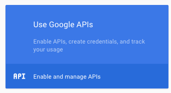
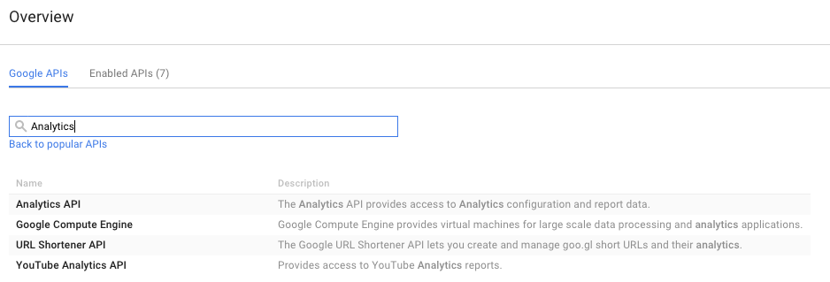
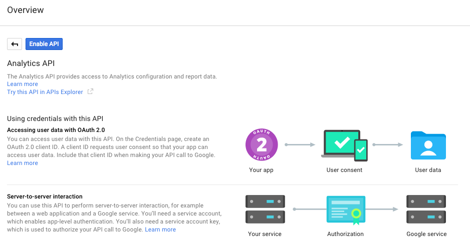
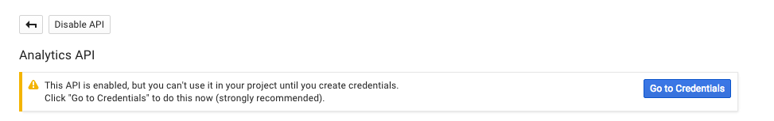
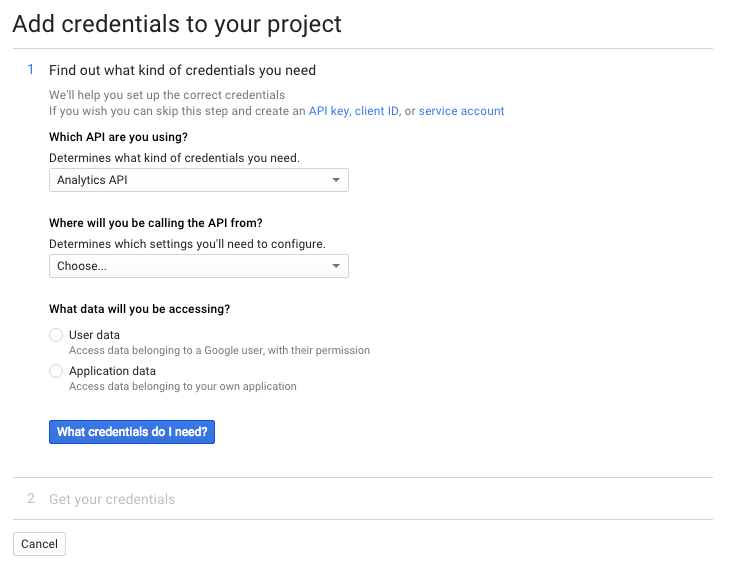
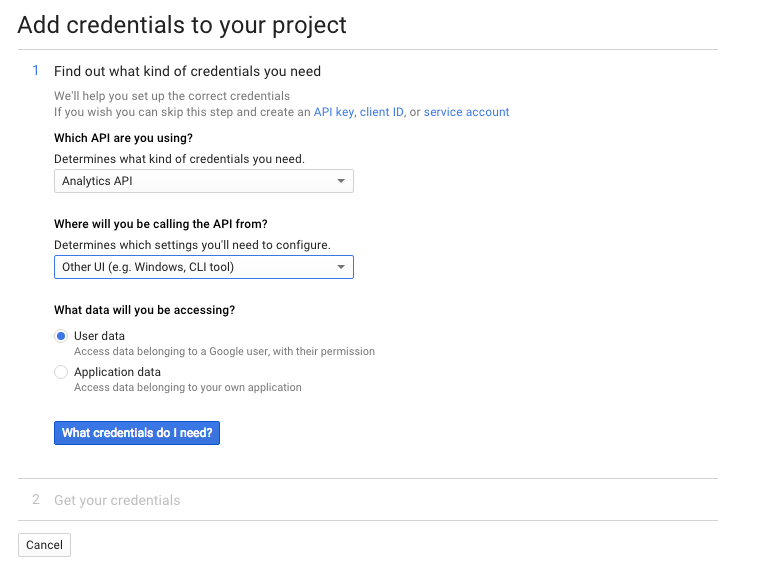
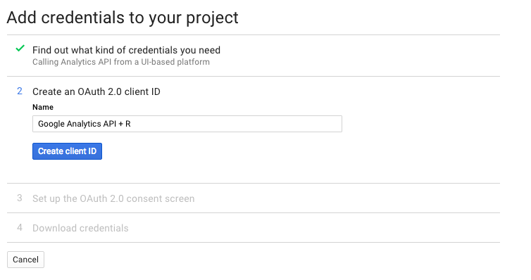
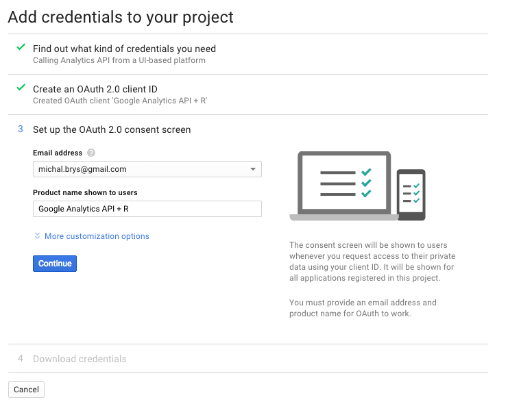
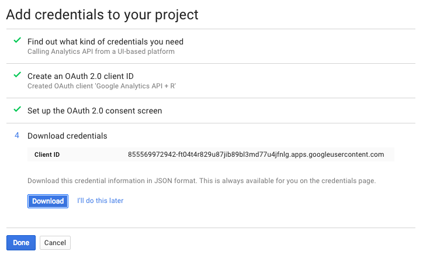
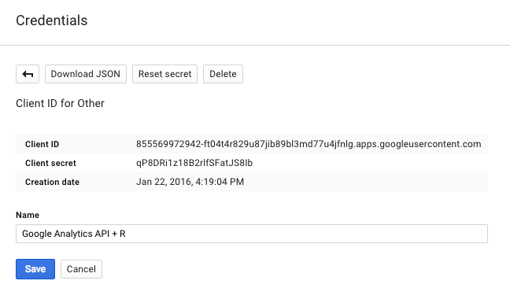

# Getting credentials for Google Analytics API

> **Note**: you can use default credentials included in googleAnalyticsR package. But this API quota is shared for all googleAnalyticsR users. To guarantee that API quota is only for you - please create your own credentials. I've described this process below.

Navigate to [Google Developers Console](https://console.developers.google.com) and create **new project**.

Enable Google Analytics API:

Search: _Analytics_

Select _Enable_

Create credentials:

Get credentials:

Save **Client ID** and **Client Secret**. You will need this to configure the library that downloads data from Google Analytics into R.

