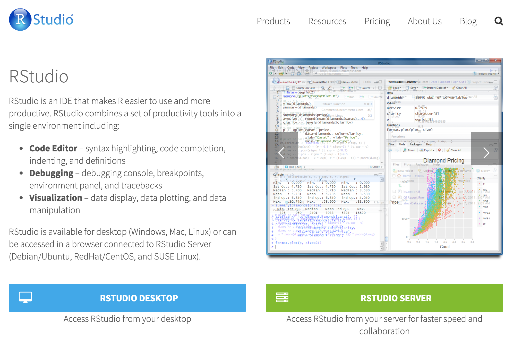

# Installing R Studio

Go to [R Studio](https://www.rstudio.com/products/rstudio2/) and download **R Studio Desktop** - graphic interface tool for R language.



R Studio is available for multiple platforms: Windows, Mac, Linux.

You can use R Studio for free under AGPL 3. Paid version with more functionality is also available.

## Installing extra packages

One of the biggest advantage of R are thousands of libraries which extend R functionality.

You can browse these packages on CRAN repository.

To install new package in R, type:

```r
install.packages("package name")
```

For example to install `ggplot2` plotting library, type:

```r
install.packages("ggplot2")
```

After installing and before using the package you should load it to the current session:

```r
library("ggplot2")
```
