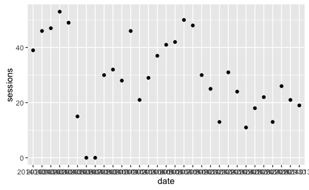
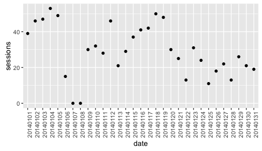
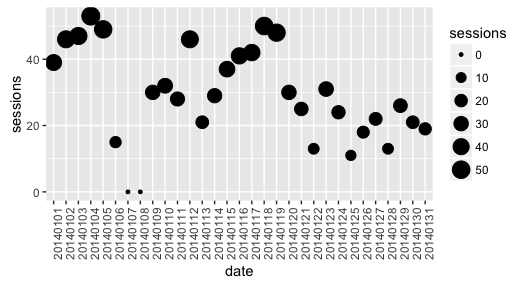
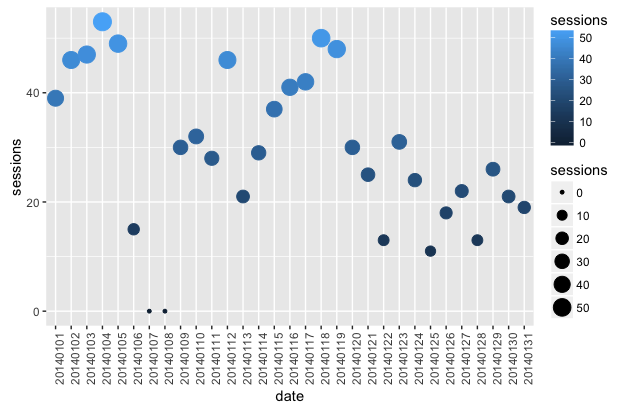
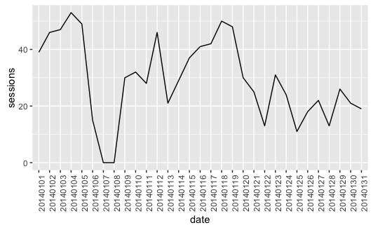
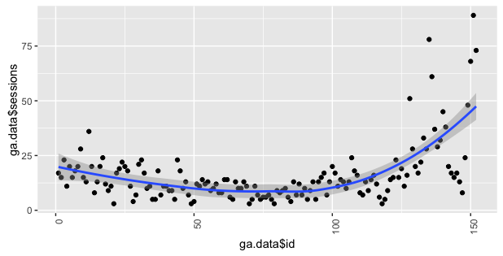
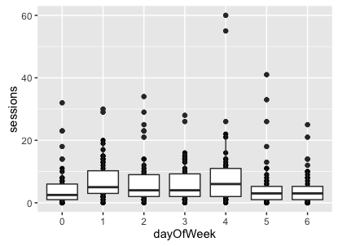

# Data visualization in R

Let's make some exploratory data analysis in R by visualizing the data from Google Analytics.

R has a big range of visualizing packages. My favourite is he `ggplot2` package.

## Package ggplot2

According to [ggplot2 project site](http://ggplot2.tidyverse.org/):

> ggplot2 is a plotting system for R, based on the grammar of graphics, which tries to take the good parts of base and lattice graphics and none of the bad parts. It takes care of many of the fiddly details that make plotting a hassle \(like drawing legends\) as well as providing a powerful model of graphics that makes it easy to produce complex multi-layered graphics.

Full documentation: [ggplot2.tidyverse.org](http://ggplot2.tidyverse.org/reference/)

This is my favourite visualization package in R because of:

* Nice charts design.
* Flexibility.
* Wide range charts types.
* Extended plugins i.e. `ggtheme`.

You can also check out the alternatives like [Plotly](https://plot.ly/r/) or [R Base Graphic](https://flowingdata.com/2016/03/22/comparing-ggplot2-and-r-base-graphics/).

All of the examples presented in this book are made with the use of `ggplot2`.

## Using ggplot2

### Download data to visualize it in the chart

In the first, step install (if necessary) and load the packages in the current session:

```r
install.packages("tidyverse")
library("tidyverse")
```

Next, build the query to fetch the data pointing out the date and the number of session that you want to download:

```r
gadata <- google_analytics(id = ga_id, 
                           start="2016-01-01", end="2016-06-30",
                           metrics = "sessions", 
                           dimensions = "date",
                           max = 5000)
```

Display first 6 rows of the results:

```r
head(gadata)
```

```r
        date sessions
1 2016-01-01      199
2 2016-01-02      212
3 2016-01-03      155
4 2016-01-04      210
5 2016-01-05      192
6 2016-01-06      180
```

### Scatter plot

Let's plot the data againts the time \(scatter plot\):

```r
gadata %>%
ggplot(aes(x=date, y=sessions)) +
  geom_point()
```

As a result you will get a basic scatter plot with **the number of sessions against the time**:



A point stands for a number of sesions in a particular day.

As you can see this plot isn't very readable because of x-axis labels. You can fix this using 90-degree pivot.

Add the following line:

```r
theme(axis.text.x = element_text(angle = 90, hjust = 1))
```

To complete the example with rotated x-axis labels, use:

```r
gadata %>%
ggplot(aes(x=date, y=sessions)) +
  geom_point() +
  theme(axis.text.x = element_text(angle = 90, hjust = 1))
```

And the result is the following:



You can also change the size of points, depending on the number of sessions, by adding:

```r
size = sessions
```

```r
gadata %>%
ggplot(aes(x=date, y=sessions, size = sessions)) +
  geom_point() +
  theme(axis.text.x = element_text(angle = 90, hjust = 1))
```

And the result is the following:



You can also change the color of the points by adding:

```r
color = sessions
```

\(the lighter color the highest number of sessions\).

The complete code presents itself as:

```r
gadata %>%
ggplot(aes(x=date, y=sessions, size = sessions, color = sessions)) +
  geom_point() +
  theme(axis.text.x = element_text(angle = 90, hjust = 1))
```

And the result is the following:



This type of scatter plot is called a **bubble chart**.

### Line chart

Let's plot the data against the time \(line chart\) with some styles:

```r
gadata %>%
ggplot(aes(x=date,y=sessions,group=1)) + 
  geom_line() + 
  theme(axis.text.x = element_text(angle = 90, hjust = 1)) 
  # some styles to rotate x-axis labels
```

As a result you will get line chart with **the number of sessions against the time**:



### Scatter plot with a trend line

Sometimes you want to aggregate the data and see what is the trend.

```r
gadata <- google_analytics(id = ga_id, 
                           start="2016-01-01", end="2016-06-30",
                           metrics = "sessions", 
                           dimensions = "date",
                           max = 5000)
```

Now we can plot the data points with a trend line added:

```r
gadata %>%
ggplot(aes(x = gadata$date,y = gadata$sessions) ) + 
  geom_point() + 
  geom_smooth() +
  theme(axis.text.x = element_text(angle = 90, hjust = 1))
```



In this plot you can see that the trend is growing :\)

### Box plot

To make some exploratory data analysis, you can visualize your traffic against different days of week. Such a chart may help you answer the following quetions: Is your website traffic seasonal? Which are more crowded days? Let's create a **box plot** which will illustrate a distribution of number of sessions in every day of week:

Build the query to download data:

```r
gadata <- google_analytics(id = ga_id, 
                           start="2016-01-01", end="2016-06-30",
                           metrics = "sessions", 
                           dimensions = c("dayOfWeek","date"),
                           max = 5000)
```

And vizualize it using a boxplot:

```r
gadata %>%
ggplot(aes(x = dayOfWeek, y = sessions)) + 
  geom_boxplot()
```



In Google Analytics, `dayOfWeek` are named with the following convention:

```r
0 - Sunday
1 - Monday
2 - Tuesday
3 - Wednesday
4 - Thursday
5 - Friday
6 - Saturday
```

In this case, we can see that the highest traffic was on Thursday. Fridays are also not bad :)

## The source code

The complete source code of the examples showed above is in my GitHub repository:

[github.com/michalbrys/R-Google-Analytics/blob/master/3_data_visualization.R](https://github.com/michalbrys/R-Google-Analytics/blob/master/3_data_visualization.R)

