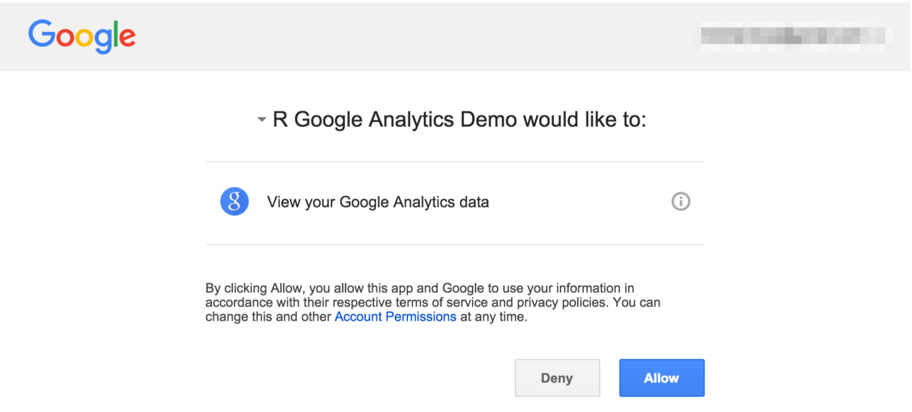

# Connection with Google Analytics

To easily download data directly from Google Analytics server to your R Studio via an API interface you have to extend R Studio using external package. This package will let you to easily build queries to Google Analytics servers, authorize connection and fetch the data to your computer. External packages are one of the biggest advantages of R. So let's do it!

## Install the googleAnalyticsR package

In the first step install the necessary libraries in your R Studio.

```r
install.packages("googleAuthR")
install.packages("googleAnalyticsR")
```

When it's done, load the libraries into the current R session:

```r
library("googleAuthR")
library("googleAnalyticsR")
```

## Configure the connection between R and Google Analytics API

Configure the package with credentials from Google Developers Console: \(How to get them? See [Getting credentials for Google Analytics API](chapter1/gettingcredentialsfor_google_analytics_api_md_md_m.md)\)

```r
# optional - add your own Google Developers Console key
options(googleAuthR.client_id = "uxxxxxxx2fd4kesu6.apps.googleusercontent.com")
options(googleAuthR.client_secret = "3JhLa_GxxxxxCQYLe31c64")
options(googleAuthR.scopes.selected = "https://www.googleapis.com/auth/analytics")

# authorize the connection with Google Analytics servers
ga_auth()
```

You will be asked to authorize R for downloading data from Google Analytics and your browser will open the authorization page. Click **Agree**:



All done. You can now start to send queries via Google Analytics API.

## First query - "Hello world"

Let's make the first query to Google Analytics via R:

```
## get a list of your accounts
account_list <- google_analytics_account_list()

## pick a profile with data to query
#ga_id <- account_list[275,'viewId']

# or give it explicite using tool http://michalbrys.github.io/ga-tools/table-id.html in format 99999999
ga_id <- 00000000


# Get the Sessions by Date in 2016
gadata <- google_analytics(id = ga_id, 
                                start="2016-01-01", 
                                end="2016-06-30", 
                                metrics = "sessions", 
                                dimensions = "date", 
                                max = 5000)
```

## How to get your table.id?

For the first time it may be a little tricky. The `ga_id` is a parameter that identifies your website data \(especially a unique `view`\) on Google Analytics' servers. Where to find that id?

### A tool using Google Analytics Management API

You can use my tool to get `table.id`.  
Navigate to my tool [michalbrys.github.io\/ga-tools\/](http://michalbrys.github.io/ga-tools/table-id.html) and follow the instructions.

### Copy from your Google Analytics web interface link

Navigate to **Admin** section on your Google Analytics account. Select your website, property and view which one you want to query.

You will see this screen:


Your Google Analytics table.id parameter is the last number from URL.

For example if your current URL is:

`https://analytics.google.com/analytics/web/?authuser=0#management/Settings/a11111111w22222222p33333333/`

In query parameters in R script you need to type:

```r
...
ga_id <- 33333333
...
```

## Display the results

After you successfully run your first query you can check the results fetched from Google Analytics.
Display first 6 rows of the result:

```r
head(gadata)
```

```r
      date sessions
1 20140101       39
2 20140102       46
3 20140103       47
4 20140104       53
5 20140105       49
6 20140106       15
```

Congrats! You've downloaded the first dataset from your Google Analytics account!

## Source code

The complete source code of the examples showed above is in my GitHub repository:

[https:\/\/github.com\/michalbrys\/R-Google-Analytics\/blob\/master\/1\_hello\_world.R](https://github.com/michalbrys/R-Google-Analytics/blob/master/1_hello_world.R)


