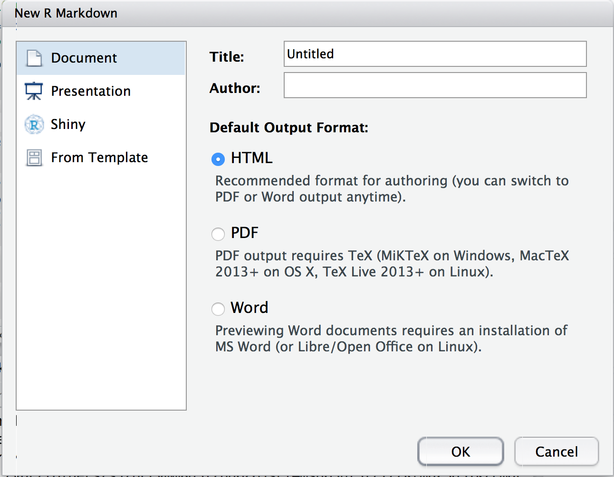

# Create report

To generate basic report template use this code. This report will contain title, sessions in time scatter plot from `chapter 2` \([Data visualization in R](chapter3/data_visualization_in_r.md)\).

## Create new RMarkdown report

In R Studio, navigate to `File > New file > R Markdown`.

You will see window with some basic configuration options. Change this values or you can do this later directly in code.



You can select output of your report. Select `HTML`,`PDF` or `Word`.

Click OK and delete sample code.

## Prepare custom report with Google Analytics data

Copy this code to R Studio and click `Knit HTML` icon. This code will generate HTML report with data downloaded from Google Analytics.

    ---
    title: "Google Analytics Traffic Report"
    author: "Michal Brys"
    output: html_document
    ---

    ```{r, echo=FALSE, warning=FALSE,error=FALSE, message=FALSE }
    ga_id <- 67980704
    date_start <- "2016-01-01"
    date_end <- "2016-06-30"

    #install.packages("googleAnalyticsR")
    #install.packages("ggplot2")
    library("googleAnalyticsR")
    library("ggplot2")

    #Run once from the console, then generate knitr document
    ga_auth()
    ```

    ### Sessions from `r date_start` to `r date_end`
    This chart contains scatter plot of sessions number in date range.

    ```{r, echo=FALSE, warning=FALSE,error=FALSE, message=FALSE }
    gadata <- google_analytics(id = ga_id, 
                               start= date_start, end= date_end, 
                               metrics = c("sessions"),
                               dimensions = c("date"),
                               max = 5000)

    # scatter plot with trend line
    ggplot(data = gadata, aes(x = gadata$date,y = gadata$sessions) ) + 
      geom_point() + 
      geom_smooth() +
      theme(axis.text.x = element_text(angle = 90, hjust = 1))
    ```

    ### Users engagement by device type
    This chart contains bar chart with avgSessionSuriation  divided by device type.

    ```{r, echo=FALSE, warning=FALSE,error=FALSE, message=FALSE }
    gadata2 <- google_analytics(id = ga_id, 
                               start= date_start, end= date_end,  
                               metrics = c("sessions", "avgSessionDuration"),
                               dimensions = c("date", "deviceCategory"),
                               max = 5000)


    #plot sessions with deviceCategory
    ggplot(gadata2, aes(deviceCategory, sessions)) +   
      geom_bar(aes(fill = deviceCategory), stat="identity")

    #plot avgSessionDuration with deviceCategory
    ggplot(gadata2, aes(deviceCategory, avgSessionDuration)) +   
      geom_bar(aes(fill = deviceCategory), stat="identity")
    ```

## Result

As a result you'll get complete HTML file with report. You can also generate PDF file.

For recurring reporing you can only change dates :\)


## Source code

Complete code for this example in GitHub repository:

[github.com\/michalbrys\/R-Google-Analytics\/blob\/master\/8\_rmarkdown\_report.Rmd](https://github.com/michalbrys/R-Google-Analytics/blob/master/8_rmarkdown_report.Rmd)

